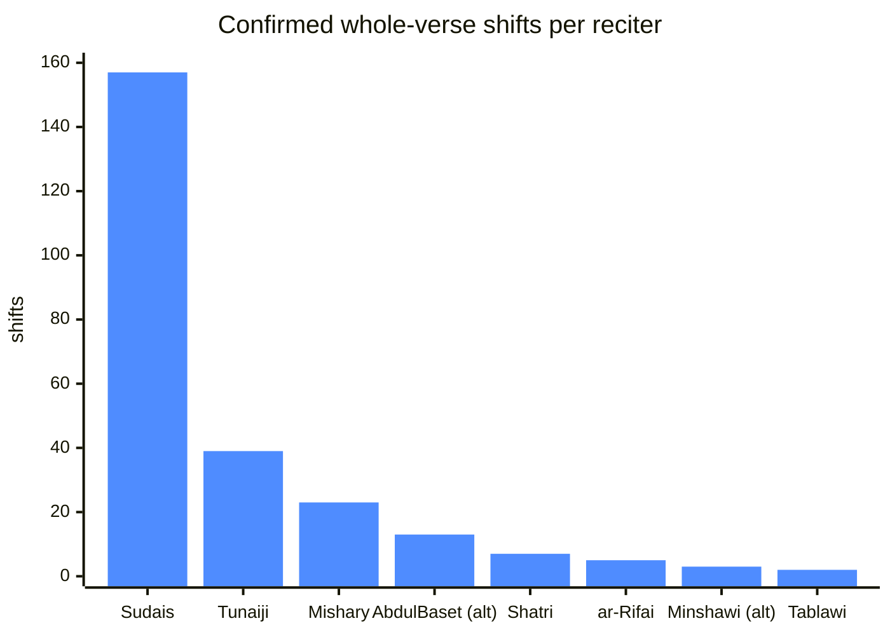
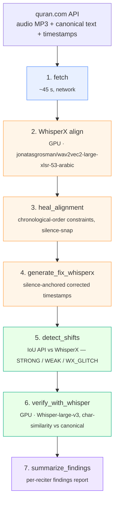

# qrfix

**Detect and fix per-verse audio-to-translation timing bugs in the
quran.com / QUL recitation API.**

[](LICENSE)
[](https://www.python.org/)
[](docs/methodology.md)

The English translation column on quran.com flips out of sync with the
recited audio for several reciters. The bug isn't in the frontend — it
lives in the per-verse `timestamp_from` / `timestamp_to` data served by
the API and stored in the [Quran Universal Library](https://qul.tarteel.ai/)
(QUL) backend.

`qrfix` is a small Python pipeline that flushes those bugs out and
produces ready-to-file corrections.

---

## TL;DR — what it found

Across the 12 reciters currently exposed by `api.quran.com`,
**249 confirmed whole-verse shifts** were detected (Whisper character-
similarity ≥ 0.70 against a neighbour verse), plus hundreds of smaller
boundary drifts.



| reciter             | id  | shifts | example                                                |
|---------------------|----:|-------:|--------------------------------------------------------|
| Sudais              |   3 |    157 | 36 shifts in Surah 3 alone, mixed offsets ±1 ±2 ±3     |
| Tunaiji             | 161 |     39 | Surah 10: 29 verses off by +1 or +2                    |
| Mishary al-Afasy    |   7 |     23 | Surah 37: sustained +1 shift across ~50 verses         |
| AbdulBaset (alt)    |   2 |     13 | Surah 2: cluster of 13 shifts in Al-Baqarah            |
| Shatri              |   4 |      7 | Surah 10: six +1 shifts                                 |
| Hani ar-Rifai       |   5 |      5 | Surah 16: five -1 shifts                                |
| Minshawi (alt)      |   9 |      3 | Surah 4                                                  |
| Tablawi             |  11 |      2 | Surah 4                                                  |

Five reciters were verified clean. Full per-surah table:
[`docs/findings.md`](docs/findings.md).

---

## What you actually hear

When the API claims verse 82:10 plays from 48.46 s to 53.95 s, the
quran.com frontend shows the English translation of verse 10 during that
window. But this is what the audio actually contains:

```
─────────────────────────────────────────────────────────────────────────
 Mishary al-Afasy — Surah 82 (Al-Infitar)
─────────────────────────────────────────────────────────────────────────
 API verse  Audio span      Whisper transcribed       Match → real verse
 ──────────  ─────────────  ─────────────────────────  ──────────────────
   82:10     48.46–53.95s   "لا بل تكذبون بالدين"      0.97 → 82:9
   82:11     53.95–58.26s   "وإن عليكم لحافظين"        0.97 → 82:10
   82:13     62.54–67.84s   "يعلمون ما تفعلون"         0.86 → 82:12
   82:16     78.06–84.75s   "إن الفجار لفي جحيم"       0.97 → 82:14   (-2)
   82:19     98.36–111.6s   "ثم ما أدراك ما يوم الدين" 0.92 → 82:18
─────────────────────────────────────────────────────────────────────────
```

Every flagged verse comes with a Whisper-transcription cross-check and a
character-similarity score, so each row is independently audibly
verifiable in 30 seconds.

---

## How the pipeline works



Two failure modes get caught with two different signals:

- **Boundary drift** — verse identity is right, but the boundary fires a
  few hundred ms to a couple of seconds early/late. Caught by
  silence-anchored hybrid fix (steps 3-5).
- **Whole-verse shift** — the API span for verse N actually contains a
  *different* verse's audio. Caught by Whisper-transcription cross-check
  (step 6) — the most reliable signal in the pipeline.

Why two signals are needed, plus design rationale and failure modes, in
[`docs/methodology.md`](docs/methodology.md).

---

## Quick start

After [installation](docs/install.md):

```bash
# Khalifah Al Tunaiji (reciter id 161) — single-command end-to-end
python analyze_tunaiji.py
```

That single command does everything for one reciter: fetches data,
aligns, heals, generates corrections, runs the Whisper cross-check,
writes a report to `reports/tunaiji_findings.md`. Every step is
idempotent so subsequent runs are nearly instant.

For other reciters:

```bash
python process_reciter.py 7 --name "Mishary al-Afasy"
python process_reciter.py 4 --name "Abu Bakr al-Shatri"
python run_all_reciters.py --whisper-model medium       # all 12 reciters
```

For audible side-by-side verification (red = current API,
green = corrected) in a browser:

```bash
python build_demo.py 13 78 82
python serve.py        # browse to http://localhost:8000/demo/
```

Full step-by-step usage and tunable thresholds:
[`docs/manual.md`](docs/manual.md).

---

## Example output

After a run, `reports/<reciter>_findings.md` looks like this (excerpt
from Tunaiji):

```markdown
## Whole-verse shifts (Whisper-verify, sim ≥ 0.70)

| surah | name       | n_shifts | verses                            | offsets |
|------:|:-----------|---------:|-----------------------------------|--------:|
|    10 | Yunus      |       29 | 28, 31-32, 43, 46-47, 51-52, ...  | +1, +2  |
|    13 | Ar-Rad     |        4 | 2-5                                | -1      |
|    14 | Ibrahim    |        2 | 5, 36                              | +1      |
|    34 | Saba       |        2 | 48-49                              | +1      |

## Boundary drift (hybrid fix, ≥ 150 ms)

| surah | n_boundaries | verses              | max |Δ| (ms) | direction |
|------:|-------------:|---------------------|-------------:|:----------|
|    13 |           24 | 13-33, 39, 41-42    |         2491 | mixed     |
|    72 |            5 | 12-15, 17           |          949 | LATE      |
```

Each finding ships with the per-verse JSON that produced it
(`reports/whisper_verify_r<id>.json`), so any threshold can be
re-audited or re-run with stricter cutoffs.

---

## Repo layout

```
qrfix/
├── analyze_tunaiji.py         ← single-command entry for one reciter
├── process_reciter.py         ← end-to-end for any reciter id
├── run_all_reciters.py        ← orchestrate every reciter on quran.com
│
├── fetch_reciter.py           # download audio + API timestamps + text
├── batch_align.py             # WhisperX forced alignment (GPU)
├── force_align.py             # alignment library used by batch_align
├── heal_alignment.py          # chronological-order post-processor
├── generate_fix_whisperx.py   # hybrid silence + WhisperX boundary fix
├── detect_shifts.py           # IoU shift detector (CTC-only signal)
├── verify_with_whisper.py     # Whisper-transcription cross-check (GPU)
├── summarize_findings.py      # cross-reciter aggregator
├── status.py                  # one-screen pipeline state view
├── build_demo.py              # A/B HTML player for audible verification
├── serve.py                   # localhost static server for the demos
├── reciter_paths.py           # per-reciter file layout
│
├── docs/
│   ├── install.md             # detailed install (CUDA, ffmpeg, etc.)
│   ├── manual.md              # full per-script usage guide
│   ├── methodology.md         # why the pipeline is shaped this way
│   └── findings.md            # all confirmed bugs across reciters
│
├── reports/                   # human-readable curated findings
├── legacy/                    # superseded scripts kept for reference
└── pyproject.toml             # `pip install -e .` makes everything callable
```

Heavy artefacts (`audio/`, `data/`, `reciters/`, `repos/`, `demo/`,
`logs/`) are generated locally and `.gitignore`d — they don't ship.

---

## Hardware

Tested on Windows 11 + RTX 4090 + CUDA 13.x and on Linux + CUDA 12.x.
Smaller GPUs work; the slow step is Whisper-verify on long surahs.

| Step                       | Compute        | Time per reciter (full Quran) |
|----------------------------|----------------|------------------------------:|
| fetch                      | network        |                          ~45 s |
| align (wav2vec2)           | GPU            |                    10–300 min |
| heal                       | CPU + ffmpeg   |                          ~5 min |
| fix                        | CPU + ffmpeg   |                          ~1 min |
| detect                     | CPU            |                           < 1 s |
| Whisper-verify (medium)    | GPU            |                         ~30 min |
| Whisper-verify (large-v3)  | GPU            |                         ~60 min |

---

## Contribution path to QUL

Once you're confident in a finding, file an issue at
<https://github.com/TarteelAI/quranic-universal-library/issues> with:

- the reciter id and surah(s),
- the corrected `data/corrected_v2/surah_<N>_qul.csv`,
- a short screen-recording of the demo player showing the wrong-vs-right
  flip,
- the `reports/whisper_verify*.json` excerpt with character-similarity
  evidence.

A ready-to-paste example issue body is at
[`reports/qul_issue_mishary_surah82.md`](reports/qul_issue_mishary_surah82.md).

The full filing playbook (and suggested order: easiest-to-defend first)
is in [`docs/findings.md`](docs/findings.md).

---

## Acknowledgements

- [WhisperX](https://github.com/m-bain/whisperX) (Bain et al., 2023) for the alignment infrastructure.
- [`jonatasgrosman/wav2vec2-large-xlsr-53-arabic`](https://huggingface.co/jonatasgrosman/wav2vec2-large-xlsr-53-arabic) — CTC acoustic model.
- [OpenAI Whisper](https://github.com/openai/whisper) — independent transcription cross-check.
- [TarteelAI / QUL](https://qul.tarteel.ai/) — the public data layer this work is trying to improve.
- [quran.com](https://quran.com) — API and audio hosting.

## License

[MIT](LICENSE).
